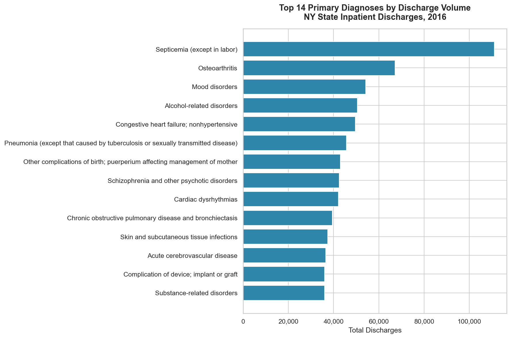
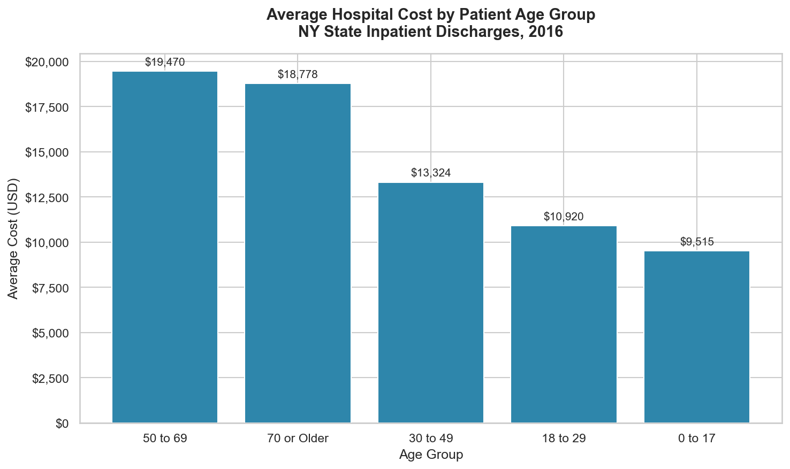
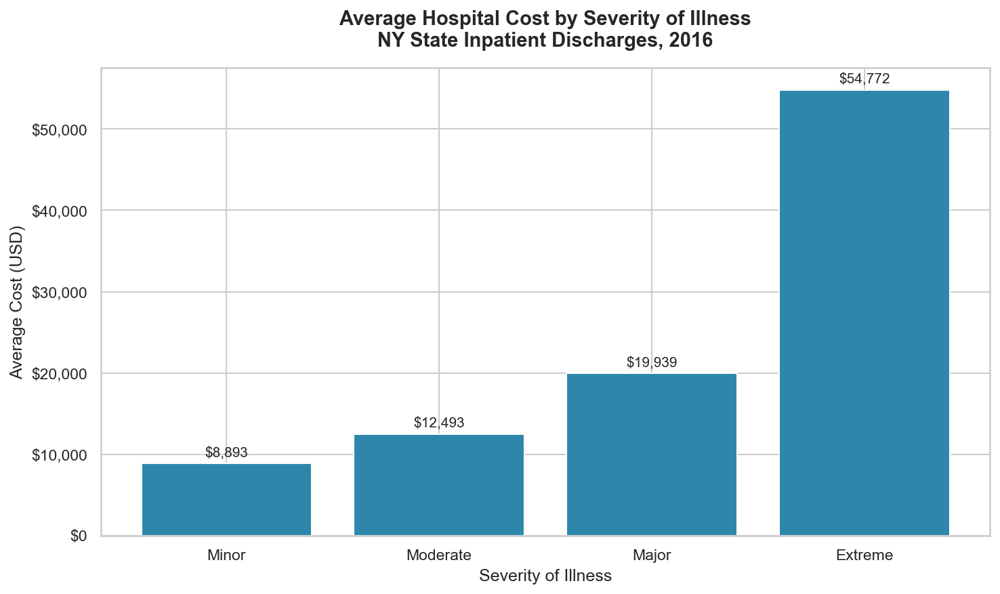
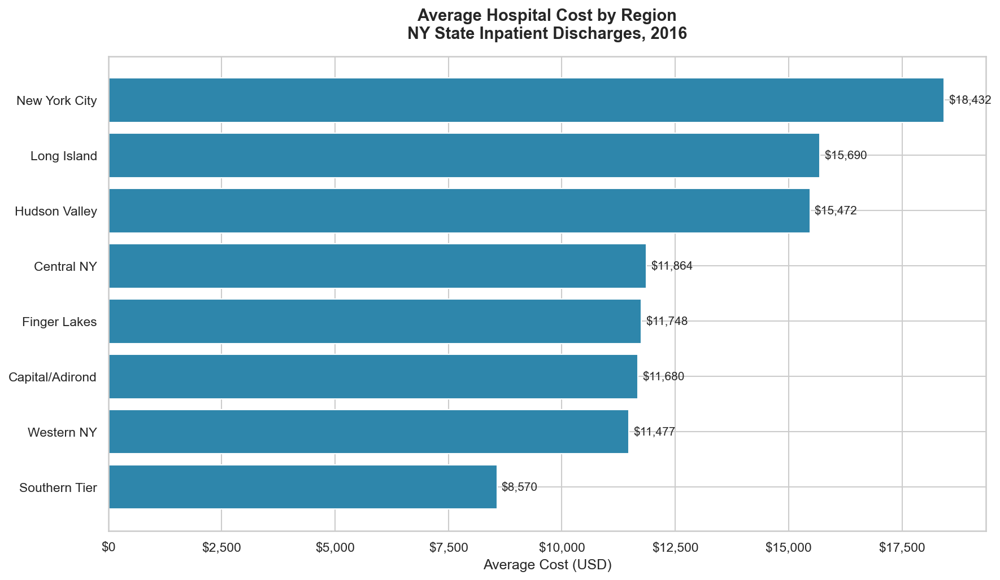
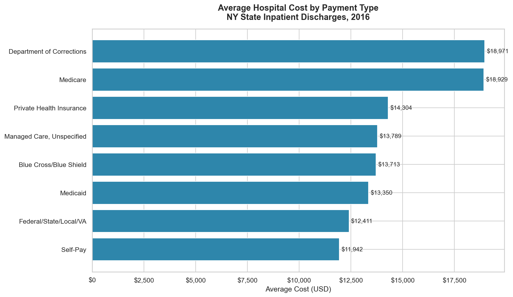

# Healthcare Data Analysis — NY State Hospital Discharges

An end-to-end SQL and Python analysis of 2.3 million inpatient discharge records from
New York State hospitals, sourced from the NY State Department of Health (SPARCS dataset).

---

## Project Metrics

- 2,343,429 patient discharge records analyzed
- 7 SQL queries written across costs, demographics, severity, and regional analysis
- 5 analytical visualizations generated
- SQLite database built from raw CSV data
- Data cleaning applied via SQL view — source data never modified

## Skills Demonstrated

- SQL querying, aggregation, and view creation
- Data cleaning and preprocessing at scale
- Exploratory data analysis (EDA)
- Healthcare cost and utilization analysis
- Data visualization with matplotlib and seaborn
- SQLite database design and management
- Performance optimization — data aggregated in SQL before loading into memory

---

## Objective

To support operational and financial decision-making in a healthcare setting by identifying
patterns in hospital costs, patient demographics, diagnosis frequency, admission types,
and regional cost disparities across New York State.

---

## Tools & Technologies

- **Python** — pandas, matplotlib, seaborn
- **SQL** — SQLite via Python's sqlite3 module
- **Jupyter Notebook** — analysis and visualization
- **VS Code** — development environment
- **Power BI** — interactive dashboard built on aggregated SQL outputs for business stakeholder reporting

---

## Project Structure

```text
healthcare-sql-analysis/
├── data/
│   ├── hospital_discharges.csv   # Raw source data
│   └── healthcare.db             # SQLite database
├── notebooks/
│   └── healthcare_analysis.ipynb # Full analysis notebook
├── sql/
│   └── analysis_queries.sql      # All SQL queries used in analysis
├── visuals/                      # Exported charts
├── load_data.py                  # Data ingestion script
└── requirements.txt
```

---

## Dataset

- **Source:** [NY State SPARCS Inpatient Discharges](https://health.data.ny.gov/api/views/gnzp-ekau/rows.csv?accessType=DOWNLOAD)
- **Records:** 2,343,429 discharges
- **Year:** 2016
- **Fields:** Diagnosis, admission type, severity, length of stay, total charges, total costs, region, demographics, payment type

> **Note:** The raw dataset (862MB) and SQLite database are excluded from this repository due to
> size constraints. To reproduce the analysis, download the CSV from the link above, place it in
> the `data/` folder as `hospital_discharges.csv`, and run `load_data.py` to build the database.

---

## Data Cleaning

Raw data quality issues identified and resolved before analysis:

- Standardized inconsistent categorical values (`'U'` → `'Unknown'`, `'Not Available'` → `'Unknown'`)
- Converted `length_of_stay` from TEXT to INTEGER by stripping NY State's `'120 +'` reporting cap
- Flagged records with zero or near-zero costs for exclusion from financial queries
- All cleaning applied through a SQL view — raw table preserved without modification
- Used SQL aggregation before loading results into pandas to avoid pulling 2.3M rows into memory

---

## Example SQL Query

```sql
-- Average cost and length of stay by severity of illness
SELECT
    apr_severity_of_illness_description AS severity,
    COUNT(*) AS total_cases,
    ROUND(AVG(total_costs), 2) AS avg_cost,
    ROUND(AVG(length_of_stay), 1) AS avg_stay
FROM discharges_clean
WHERE bad_cost_flag = 0
GROUP BY apr_severity_of_illness_description
ORDER BY avg_cost DESC;
```

---

## Visualizations







---

## Key Findings

### 1. Severity is the Strongest Cost Predictor


Extreme severity cases average $54,772 — 6x the cost of Minor cases at $8,893, with length
of stay rising from 3.1 to 15.2 days across severity levels.

### 2. NYC Costs 57% More Than Upstate Regions
New York City averages $18,432 per discharge vs $8,570 in the Southern Tier. Regional cost
differences are driven by pricing and case mix, not length of stay.

### 3. Leukemia is the Most Expensive Diagnosis
At $80,944 average cost and 18.9 average days, it far outpaces the next most expensive
diagnosis (heart valve disorders at $57,552).

### 4. Medicare Dominates Volume and Cost
884,209 discharges at an average cost of $18,929 — 42% higher than Medicaid at $13,350.

### 5. Trauma Admissions Are the Most Resource Intensive
6,629 cases averaging 6.4 days and $24,679 per discharge, the highest of any admission type.

### 6. Middle-Aged Patients Drive the Highest Costs
The 50-69 age group averages $19,470 per discharge, double the cost of patients under 30,
and represents the largest patient volume in the dataset.

---

## Business Impact

This analysis demonstrates how healthcare systems can:
- Identify high-cost patient groups to target cost reduction initiatives
- Allocate hospital resources more efficiently based on admission type and severity
- Understand regional cost disparities to inform pricing and staffing decisions
- Forecast financial burden by payer type and patient demographics
- Support operational planning using large-scale discharge data

---

## How to Run

```bash
git clone https://github.com/AkilAhnaf18/Healthcare-SQL-Analysis.git
cd healthcare-sql-analysis
pip install -r requirements.txt
python load_data.py
```

Then open `notebooks/healthcare_analysis.ipynb` and run all cells.

---

## Conclusion

This project demonstrates end-to-end data analysis on a large-scale public healthcare dataset
using SQL and Python. It covers the full analyst workflow — ingestion, cleaning, querying,
and visualization — and surfaces actionable insights around cost drivers, regional disparities,
and resource utilization relevant to healthcare analytics and data analyst roles.